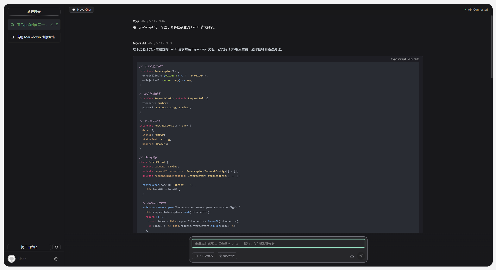
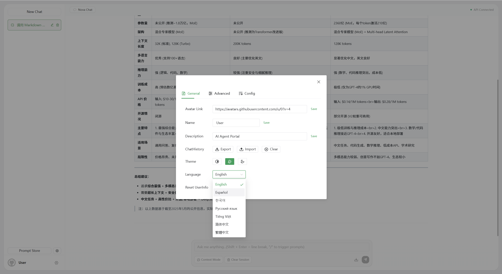
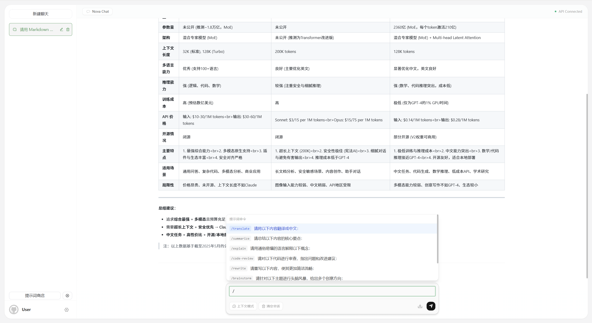
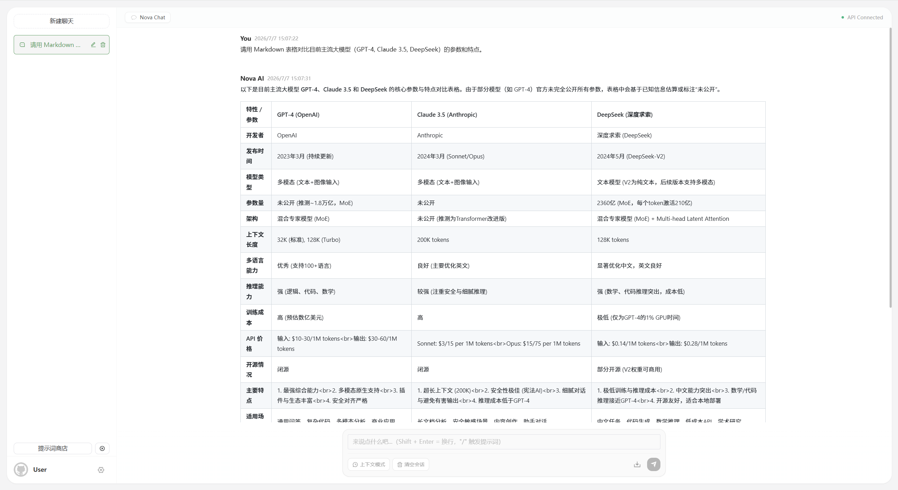

<p align="center">
  
  
  
  
  
  
</p>

<h1 align="center">Nova Chat</h1>

<p align="center"><strong>优雅、极简、生产就绪的现代化大模型对话门户</strong></p>

<p align="center">深色 / 浅色 · 7 国语言 · IndexedDB 持久化 · 流式响应 · 斜杠指令悬浮窗</p>

---

## 系统架构

```
┌─────────────────────────────────────────────────────┐
│                    浏览器 (Vue 3)                      │
│                                                       │
│  ┌──────────┐  ┌──────────┐  ┌───────────────────┐  │
│  │  Pinia   │  │  Dexie   │  │  Fetch +           │  │
│  │  Stores  │──│  (IDB)   │  │  ReadableStream    │  │
│  └──────────┘  └──────────┘  └───────────────────┘  │
│        │                            │                │
│        ▼                            ▼                │
│  ┌──────────────┐    ┌─────────────────────────┐    │
│  │  vue-i18n    │    │  /api/chat-process       │    │
│  │  7 languages │    │  (NDJSON stream)         │    │
│  └──────────────┘    └─────────────────────────┘    │
│                                │                     │
└────────────────────────────────┼─────────────────────┘
                                 │
                    ┌────────────▼────────────┐
                    │   Express Backend        │
                    │   :3002                  │
                    │   OpenAI-compatible API  │
                    └────────────┬────────────┘
                                 │
                    ┌────────────▼────────────┐
                    │   DeepSeek / OpenAI / …  │
                    │   任意兼容 LLM 提供商     │
                    └─────────────────────────┘
```

---

## 核心系统设计

### 1. 存储架构 — IndexedDB 关系型数据层

不再使用 `localStorage` 的全量 JSON 序列化方案。基于 **Dexie.js** 设计了非阻塞的三表关系型本地存储：

| 表 | 主键 | 索引 | 数据内容 |
|---|---|---|---|
| `conversations` | `uuid` | 唯一索引 | 对话会话（侧边栏列表） |
| `messages` | `id`（自增） | `conversationUuid`、`sortIndex`、复合索引 | 单条聊天消息 |
| `settings` | `id` | 唯一索引 | 全局 UI 状态 |

**关键设计决策**：

- **惰性水合（Lazy Hydration）**：Pinia store 启动时先返回默认状态，而后异步 `hydrate()` 从 IndexedDB 读取并 `$patch` 覆盖，避免首屏白屏
- **写时脱壳（Proxy Unwrapping）**：`setLocalState()` 通过 `JSON.parse(JSON.stringify(state))` 剥离 Vue 响应式 Proxy 再写入，避免浏览器 `DataCloneError`
- **事务原子写入**：三表清空 + 批量插入在同一 Dexie `transaction('rw')` 中完成，保证数据一致性

### 2. 网络与流控制 — Fetch + ReadableStream

完全移除对 Axios 的依赖。基于原生 **Fetch API + ReadableStream** 构建流式数据解析引擎：

```
fetch() → response.body.getReader() → TextDecoder（流式 UTF-8 解码）
    → buffer 拼接 → \n 分隔 NDJSON → JSON.parse → onProgress 回调
```

- `AbortController.signal` 原生传入 `fetch()`，秒级中断，零取消逻辑冗余
- `reader.releaseLock()` 保证流锁释放，无内存泄漏风险
- NDJSON 逐行解析，非完整行滞留在缓冲区等待下一次拼接

### 3. i18n 国际化 — 7 语言无感切换

基于 `vue-i18n` 的全语种本地化体系：

| 简体中文 | 繁体中文 | English | Español | 한국어 | Русский | Tiếng Việt |
|---|---|---|---|---|---|---|

- 语言偏好持久化到 `localStorage`，首次启动跟随 `navigator.language`
- Naive UI 组件库语言随业务文案同步切换（`useLanguage()` hook 中 `setLocale()` + Naive UI locale ID 双向绑定）
- 7 个语言文件 key 严格对齐，`fallbackLocale: 'en-US'` 保证缺 key 不报错

### 4. UI/UX 设计系统 — Mac 视窗美学

基于 **Tailwind CSS** 的完整设计语言：

- **Floating Card 架构**：主容器悬浮在 `bg-[#f4f4f5]` 冷灰底色上，`rounded-3xl` 大圆角 + `shadow-sm` 微阴影 + 极细边框
- **Light / Dark 双主题**：全组件覆盖 `dark:` 变体（`dark:bg-zinc-900`、`dark:border-zinc-800`），跟随系统或手动切换
- **斜杠指令悬浮窗**：输入 `/` 弹出自定义 Panel，↑↓ 键盘导航 + Enter 选中替换 + Esc 关闭 + 双字段模糊匹配（key + value）
- **胶囊输入区**：居中 `max-w-3xl`、`rounded-2xl` + `focus-within:shadow-md` 聚焦微升动效、左侧工具栏 + 右侧发送按钮

---

## 功能清单

- 流式实时对话（逐字输出）
- 对话历史侧边栏管理（新建 / 重命名 / 删除 / 切换）
- **Prompt 商店** — 自定义提示词模板（JSON 导入导出 + 在线推荐源）
- 上下文模式开关 — 携带或不携带历史记录
- 斜杠指令 `/` 悬浮推荐（键盘全导航 + 模糊搜索）
- 会话导出为 PNG 图片
- 7 语言无缝切换
- Light / Dark 双色主题
- 移动端响应式适配
- 访问密码保护（可选）

---

## 📸 在线展示说明

> **⚠️ 由于 GitHub Pages 仅支持静态托管，在线预览版仅供 UI/UX 交互展示。**
>
> 完整功能（流式对话、多模型代理切换、IndexedDB 持久化）需本地部署后体验，详见下方 [快速启动](#快速启动)。

## 🖼️ 界面展示

<table>
  <tr>
    <td width="50%" align="center">
      <strong>🌙 Gemini-Style 暗黑平铺画布</strong>
      <br>
      <sub><b>Gemini-Style Flat Canvas · Dark Mode</b></sub>
      <br><br>
      
      <br><br>
      <sub>
        全面重塑消息流 —— 摒弃传统聊天气泡，采用 <b>Gemini 全平铺布局</b>：用户与 AI 消息统一左对齐、
        零背景色覆盖、极简文字标识（You / Nova AI）替代头像、消息间微妙水平分割线界定对话边界。
        基于 <b>Tailwind CSS</b> <code>dark:</code> 变体实现全组件暗黑覆盖，
        <b>Highlight.js</b> 代码块自适应 <code>#1e1e24</code> 深色背景，保障长文本阅读舒适度与代码对比度。
      </sub>
    </td>
    <td width="50%" align="center">
      <strong>🌐 7 国语言实时国际化架构</strong>
      <br>
      <sub><b>Real-Time i18n · 7-Language Architecture</b></sub>
      <br><br>
      
      <br><br>
      <sub>
        基于 <b>vue-i18n 9</b> 的全语种本地化引擎 —— 简体中文 · 繁體中文 · English · Español · 한국어 · Русский · Tiếng Việt
        七套语言字典 key 严格对齐，<code>fallbackLocale: 'en-US'</code> 缺 key 兜底策略保证零报错。
        <b>Naive UI</b> 组件库 locale 通过 <code>useLanguage()</code> hook 与业务文案双向同步切换，
        语言偏好持久化至 <code>localStorage</code>，首次启动自动跟随 <code>navigator.language</code>。
      </sub>
    </td>
  </tr>
  <tr>
    <td width="50%" align="center">
      <strong>⚡ 自研斜杠指令悬浮补全系统</strong>
      <br>
      <sub><b>Slash Command Panel · Fuzzy Completion</b></sub>
      <br><br>
      
      <br><br>
      <sub>
        输入 <code>/</code> 触发的 <b>自定义悬浮面板</b>，内置 8 种快捷指令模板（translate / summarize / code-review …）。
        支持 <b>双字段模糊匹配</b>（key + value 联合筛选）、↑↓ 键盘导航 + Enter 选中替换 + Esc 关闭的完整键盘操作闭环。
        配合 <b>Prompt 商店</b> 支持 JSON 导入导出与在线推荐源，扩展自定义指令生态。
      </sub>
    </td>
    <td width="50%" align="center">
      <strong>🗄️ IndexedDB 本地关系型持久化层</strong>
      <br>
      <sub><b>IndexedDB Relational Persistence · Dexie.js</b></sub>
      <br><br>
      
      <br><br>
      <sub>
        基于 <b>Dexie.js 4</b> 设计三表关系型本地存储（<code>conversations</code> · <code>messages</code> · <code>settings</code>），
        替代传统 <code>localStorage</code> 全量 JSON 序列化方案。
        <b>Lazy Hydration</b> 惰性水合策略避免首屏白屏 —— Pinia Store 先返默认值再异步 <code>$patch</code> 覆盖；
        <b>Proxy Unwrapping</b> 写时脱壳解决 Vue 响应式代理的 <code>DataCloneError</code>；
        三表清空 + 批量写入在同一 <code>transaction('rw')</code> 中原子完成。
      </sub>
    </td>
  </tr>
</table>

---

## 快速启动

### 环境

- Node.js ≥ 18
- pnpm

### 安装

```bash
git clone <your-repo-url>
cd nova-chat
pnpm install
cd service && pnpm install && cd ..
```

### 配置 LLM API

编辑 `service/.env`，以 **DeepSeek** 为例：

```ini
OPENAI_API_KEY=sk-your-deepseek-api-key
OPENAI_API_BASE_URL=https://api.deepseek.com
OPENAI_API_MODEL=deepseek-chat
AUTH_SECRET_KEY=
MAX_REQUEST_PER_HOUR=1000
```

兼容所有 OpenAI-format API（DeepSeek / OpenAI / Moonshot / Groq 等），仅需改 `OPENAI_API_BASE_URL` 和 `OPENAI_API_MODEL`。

### 启动

```bash
# 终端 1：后端
cd service && pnpm dev     # → http://localhost:3002

# 终端 2：前端
pnpm dev                   # → http://localhost:1002
```

浏览器打开 `http://localhost:1002`，开始对话。

---

## 项目结构

```
nova-chat/
├── src/
│   ├── api/                   # Fetch + ReadableStream 流式 API
│   ├── components/            # 通用组件
│   ├── hooks/                 # useTheme / useLanguage / useScroll 等
│   ├── locales/               # 7 国语言字典
│   ├── router/                # Vue Router
│   ├── store/modules/
│   │   ├── chat/              # 聊天核心（Dexie 水合 + Pinia）
│   │   ├── prompt/            # Prompt 商店
│   │   └── ...                # auth / settings / user / app
│   ├── utils/
│   │   ├── db.ts              # Dexie.js 数据库定义
│   │   ├── storage/           # localStorage 封装
│   │   └── request/           # Axios 实例（非流式接口）
│   └── views/chat/            # 聊天主视图 + 侧边栏
├── service/                   # Express 后端（API 代理）
└── package.json
```

---

## 技术栈

| 分类 | 技术 | 用途 |
|------|------|------|
| 框架 | Vue 3 (Composition API) | 组件化 UI |
| 语言 | TypeScript | 类型安全 |
| 构建 | Vite 4 | 开发 / 构建 |
| 状态管理 | Pinia 2 | 响应式 Store |
| 路由 | Vue Router 4 | SPA 路由 |
| UI 库 | Naive UI | 对话框 / 表格 / 头像 |
| CSS | Tailwind CSS 3 | 全量 Utility-first |
| 数据库 | Dexie.js 4 (IndexedDB) | 本地关系型持久化 |
| i18n | vue-i18n 9 | 7 语言国际化 |
| Markdown | markdown-it + KaTeX | 消息渲染 + 数学公式 |
| 后端 | Express 4 | API 代理 |

---

